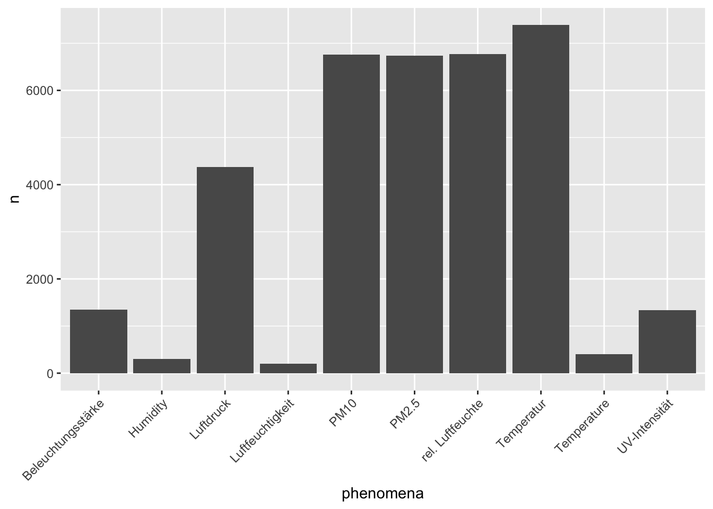
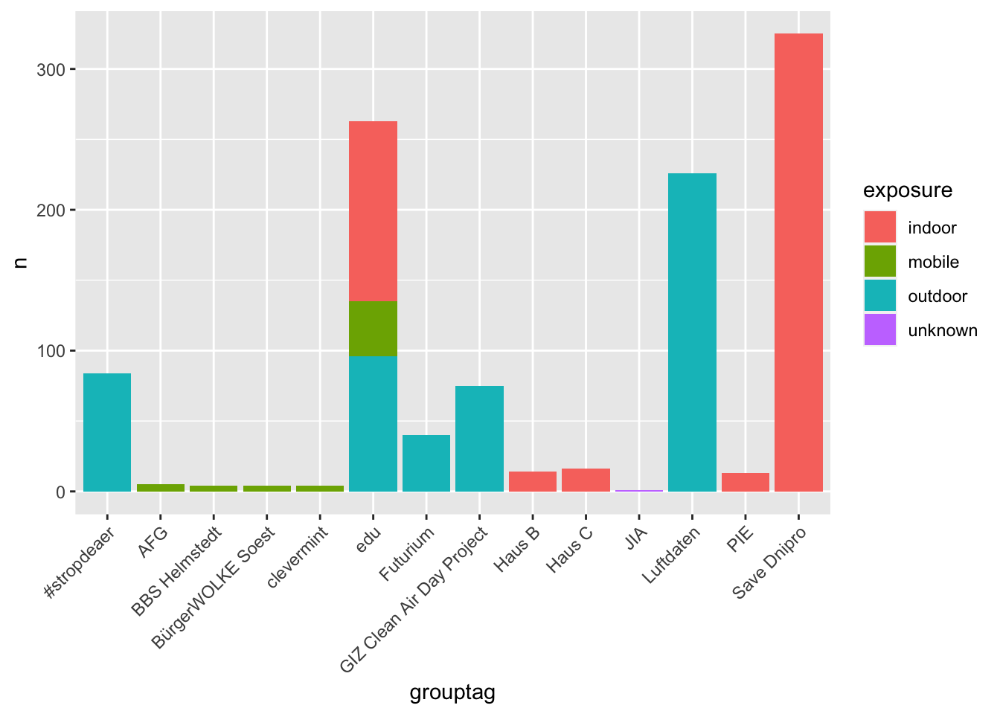
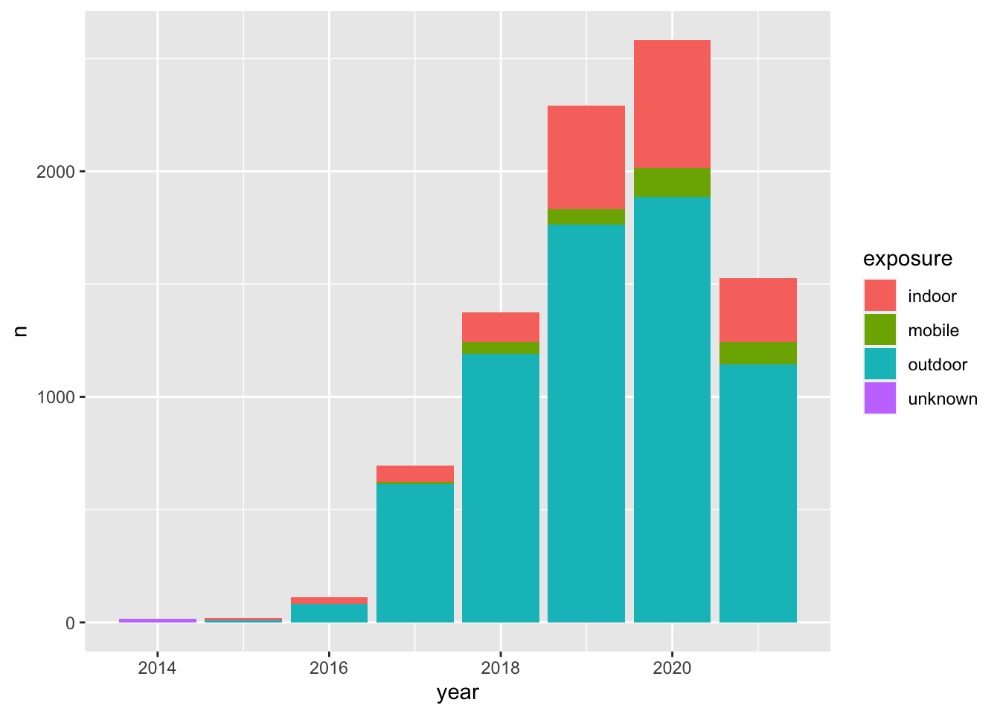

<!-- README.md is generated from README.Rmd. Please edit that file -->

[](https://travis-ci.org/JohannesFriedrich/senseBox)
[](https://ci.appveyor.com/project/JohannesFriedrich/sensebox/branch/master)
[](https://codecov.io/gh/JohannesFriedrich/senseBox)
[](http://www.repostatus.org/#active)

### Motivation

The senseBox is a do-it-yourself kit for stationary and mobile sensor
stations. With senseBox you can make measurements, helping to answer a
variety of scientific questions and to support Citizen Science Projects
from the local to global scale. Data collected by senseBox can increase
the measured density of various enviromental factors and can contribute
to more precise statements regarding climate, pollution or traffic.

openSenseMap is the platform for the publishing of senseBox and other
open sensor data. Each senseBox transmits its measurements directly to
the map, where anyone can observe, analyze and download the data.

This is the point where this **R**-pacakge comes into play: The
**R**-package senseBox provides access to the senseBox API and enables
the user to download, analyse and visualise the data provided by
registered senseBoxes.

With pacakges like `ggplot2` or `plotly` **R** is the perfect tool to
visualise data. In the next chapter you find a short introduction to the
basic usage of this **R**-package and some examples how to visualise the
data.

### Installation

``` r
if(!require("devtools"))
  install.packages("devtools")
devtools::install_github("JohannesFriedrich/senseBox")
```

### Usage

Get some information about the senseBox project and list all senseBoxIds

``` r
library(senseBox)
## Loading required package: httr

stats <- get_senseBox_stats()
```

<table>

<thead>

<tr>

<th style="text-align:left;">

variable

</th>

<th style="text-align:right;">

value

</th>

</tr>

</thead>

<tbody>

<tr>

<td style="text-align:left;">

Number of senseBoxes

</td>

<td style="text-align:right;">

6138

</td>

</tr>

<tr>

<td style="text-align:left;">

Number of Measurements

</td>

<td style="text-align:right;">

4149842980

</td>

</tr>

<tr>

<td style="text-align:left;">

Number of measurements in last minute

</td>

<td style="text-align:right;">

4937

</td>

</tr>

</tbody>

</table>

With the function `get_senseBox_Ids()` you obtain all available senseBox
Ids and the name of the station.

``` r
Id_list <- get_senseBox_Ids()
```

<table>

<thead>

<tr>

<th style="text-align:left;">

senseBoxId

</th>

<th style="text-align:left;">

name

</th>

</tr>

</thead>

<tbody>

<tr>

<td style="text-align:left;">

5386026e5f08822009b8b60d

</td>

<td style="text-align:left;">

CALIMERO

</td>

</tr>

<tr>

<td style="text-align:left;">

538ee6a4a83415541576b777

</td>

<td style="text-align:left;">

SenGIS Arbeitsgruppe - Uni Hohenheim

</td>

</tr>

<tr>

<td style="text-align:left;">

5391be52a8341554157792e6

</td>

<td style="text-align:left;">

LeKa Berlin

</td>

</tr>

<tr>

<td style="text-align:left;">

539c00c2a83415541578eaf5

</td>

<td style="text-align:left;">

IV Gummersbach

</td>

</tr>

<tr>

<td style="text-align:left;">

539fec94a8341554157931d7

</td>

<td style="text-align:left;">

The PaderWarrior Reloded

</td>

</tr>

<tr>

<td style="text-align:left;">

53a0017aa834155415793281

</td>

<td style="text-align:left;">

Alt-Lietzow

</td>

</tr>

</tbody>

</table>

You are just interested in senseBoxes, which collect data from “indoor”?
So use the function `search_senseBox()`.

``` r
indoor <- search_senseBox(exposure =  "indoor")
```

<table>

<thead>

<tr>

<th style="text-align:left;">

senseBoxId

</th>

<th style="text-align:left;">

exposure

</th>

<th style="text-align:left;">

name

</th>

<th style="text-align:left;">

createdAt

</th>

<th style="text-align:left;">

model

</th>

<th style="text-align:left;">

phenomena

</th>

<th style="text-align:left;">

unit

</th>

<th style="text-align:left;">

sensorIds

</th>

<th style="text-align:left;">

sensorType

</th>

<th style="text-align:right;">

long

</th>

<th style="text-align:right;">

lat

</th>

<th style="text-align:left;">

grouptag

</th>

<th style="text-align:left;">

updatedAt

</th>

<th style="text-align:left;">

weblink

</th>

<th style="text-align:left;">

lastMeasurementAt

</th>

<th style="text-align:left;">

description

</th>

<th style="text-align:right;">

height

</th>

</tr>

</thead>

<tbody>

<tr>

<td style="text-align:left;">

54d79ea81b93e970075153f4

</td>

<td style="text-align:left;">

indoor

</td>

<td style="text-align:left;">

Aasee-Station

</td>

<td style="text-align:left;">

1423417000

</td>

<td style="text-align:left;">

custom

</td>

<td style="text-align:left;">

c(“UV”, “Beleuchtungsstärke”, “Luftdruck”, “rel. Luftfeuchte”,
“Temperatur”)

</td>

<td style="text-align:left;">

c(“UV-Index”, “lx”, “Pa”, “%”, “°C”)

</td>

<td style="text-align:left;">

c(“54d79ea81b93e970075153f6”, “54d79ea81b93e970075153f7”,
“54d79ea81b93e970075153f8”, “54d79ea81b93e970075153f9”,
“54d79ea81b93e970075153fa”)

</td>

<td style="text-align:left;">

c(“GUVA-S12D”, “TSL2561”, “BMP085”, “DHT11”, “DHT11”)

</td>

<td style="text-align:right;">

7.604985

</td>

<td style="text-align:right;">

51.94647

</td>

<td style="text-align:left;">

NA

</td>

<td style="text-align:left;">

NA

</td>

<td style="text-align:left;">

NA

</td>

<td style="text-align:left;">

NA

</td>

<td style="text-align:left;">

NA

</td>

<td style="text-align:right;">

NA

</td>

</tr>

<tr>

<td style="text-align:left;">

54e73244a807ade00f85f5bd

</td>

<td style="text-align:left;">

indoor

</td>

<td style="text-align:left;">

PhotonicNet

</td>

<td style="text-align:left;">

1424437828

</td>

<td style="text-align:left;">

custom

</td>

<td style="text-align:left;">

c(“UV”, “Beleuchtungsstärke”, “Luftdruck”, “rel. Luftfeuchte”,
“Temperatur”)

</td>

<td style="text-align:left;">

c(“UV-Index”, “lx”, “Pa”, “%”, “°C”)

</td>

<td style="text-align:left;">

c(“54e73244a807ade00f85f5bf”, “54e73244a807ade00f85f5c0”,
“54e73244a807ade00f85f5c1”, “54e73244a807ade00f85f5c2”,
“54e73244a807ade00f85f5c3”)

</td>

<td style="text-align:left;">

c(“GUVA-S12D”, “TSL2561”, “BMP085”, “DHT11”, “DHT11”)

</td>

<td style="text-align:right;">

9.635454

</td>

<td style="text-align:right;">

52.41255

</td>

<td style="text-align:left;">

NA

</td>

<td style="text-align:left;">

NA

</td>

<td style="text-align:left;">

NA

</td>

<td style="text-align:left;">

NA

</td>

<td style="text-align:left;">

NA

</td>

<td style="text-align:right;">

NA

</td>

</tr>

<tr>

<td style="text-align:left;">

54e7a5faa807ade00f868aab

</td>

<td style="text-align:left;">

indoor

</td>

<td style="text-align:left;">

fablab potsdam

</td>

<td style="text-align:left;">

1472403276

</td>

<td style="text-align:left;">

custom

</td>

<td style="text-align:left;">

c(“UV”, “Beleuchtungsstärke”, “Luftdruck”, “rel. Luftfeuchte”,
“Temperatur”)

</td>

<td style="text-align:left;">

c(“UV-Index”, “lx”, “Pa”, “%”, “°C”)

</td>

<td style="text-align:left;">

c(“54e7a5faa807ade00f868aad”, “54e7a5faa807ade00f868aae”,
“54e7a5faa807ade00f868aaf”, “54e7a5faa807ade00f868ab0”,
“54e7a5faa807ade00f868ab1”)

</td>

<td style="text-align:left;">

c(“GUVA-S12D”, “TSL2561”, “BMP085”, “DHT11”, “DHT11”)

</td>

<td style="text-align:right;">

13.080662

</td>

<td style="text-align:right;">

52.39649

</td>

<td style="text-align:left;">

MakeLight

</td>

<td style="text-align:left;">

1481986505

</td>

<td style="text-align:left;">

NA

</td>

<td style="text-align:left;">

NA

</td>

<td style="text-align:left;">

NA

</td>

<td style="text-align:right;">

NA

</td>

</tr>

</tbody>

</table>

We chose one ID for the following examples

``` r
senseBoxId <- "592ca4b851d3460011ea2635"
```

#### Show location of senseBox

``` r
location <- get_senseBox_location(senseBoxId)

library(leaflet)
library(htmltools)

leaflet(location) %>%
  addProviderTiles(providers$OpenStreetMap) %>% 
  addTiles() %>%  
  addMarkers(~long, ~lat, popup = ~htmltools::htmlEscape(name))
```


#### Sensor Id information

Get some information about the senseBox sensors

``` r
sensor_info <- get_senseBox_sensor_info(senseBoxId)
```

<table>

<thead>

<tr>

<th style="text-align:left;">

name

</th>

<th style="text-align:left;">

phenomena

</th>

<th style="text-align:left;">

unit

</th>

<th style="text-align:left;">

sensorIds

</th>

<th style="text-align:left;">

sensorType

</th>

</tr>

</thead>

<tbody>

<tr>

<td style="text-align:left;">

Leipziger65-Süd

</td>

<td style="text-align:left;">

c(“PM10”, “PM2.5”, “Temperatur”, “rel. Luftfeuchte”)

</td>

<td style="text-align:left;">

c(“µg/m³”, “µg/m³”, “°C”, “%”)

</td>

<td style="text-align:left;">

c(“592ca4b851d3460011ea2636”, “592ca4b851d3460011ea2637”,
“592ca4b851d3460011ea2638”, “592ca4b851d3460011ea2639”)

</td>

<td style="text-align:left;">

c(“SDS 011”, “SDS 011”, “DHT22”, “DHT22”)

</td>

</tr>

</tbody>

</table>

With the argument `tidy = TRUE` a tidy data.frame will be produced:

``` r
sensor_info <- get_senseBox_sensor_info(senseBoxId, tidy = TRUE)
```

<table>

<thead>

<tr>

<th style="text-align:left;">

name

</th>

<th style="text-align:left;">

phenomena

</th>

<th style="text-align:left;">

unit

</th>

<th style="text-align:left;">

sensorIds

</th>

<th style="text-align:left;">

sensorType

</th>

</tr>

</thead>

<tbody>

<tr>

<td style="text-align:left;">

Leipziger65-Süd

</td>

<td style="text-align:left;">

PM10

</td>

<td style="text-align:left;">

µg/m³

</td>

<td style="text-align:left;">

592ca4b851d3460011ea2636

</td>

<td style="text-align:left;">

SDS 011

</td>

</tr>

<tr>

<td style="text-align:left;">

Leipziger65-Süd

</td>

<td style="text-align:left;">

PM2.5

</td>

<td style="text-align:left;">

µg/m³

</td>

<td style="text-align:left;">

592ca4b851d3460011ea2637

</td>

<td style="text-align:left;">

SDS 011

</td>

</tr>

<tr>

<td style="text-align:left;">

Leipziger65-Süd

</td>

<td style="text-align:left;">

Temperatur

</td>

<td style="text-align:left;">

°C

</td>

<td style="text-align:left;">

592ca4b851d3460011ea2638

</td>

<td style="text-align:left;">

DHT22

</td>

</tr>

<tr>

<td style="text-align:left;">

Leipziger65-Süd

</td>

<td style="text-align:left;">

rel. Luftfeuchte

</td>

<td style="text-align:left;">

%

</td>

<td style="text-align:left;">

592ca4b851d3460011ea2639

</td>

<td style="text-align:left;">

DHT22

</td>

</tr>

</tbody>

</table>

#### Download senseBox data

We can now download data from the senseBox, either from a specific
sensorId or from all sensors within the sensBox. In the following we are
downloading all available sensors.

``` r
data_all <- get_senseBox_data(senseBoxId)
```

When you are interested in just a selection of sensors, just submit the
sensorIds to the function `get_senseBox_data()`.

``` r
sensor_ids <- get_senseBox_sensor_Ids(senseBoxId)

data_sel <- get_senseBox_data(senseBoxId, 
                              sensorId = sensor_ids$sensorIds[1:2])
```

When using the above code, by default, the data from the last 48 h will
be downloaded. You can donwload up to 10,000 records and sepcify the
date of the record. The maximum time frame for downloading data is back
to one month from now. Use the argument `fromDate` and `toDate` to
specify the desired time frame. Note that in contrast to the code above,
all sensors from the senseBox are requested (by default) because
argument `sensorId` is not set.

``` r
data_timeframe <- get_senseBox_data(senseBoxId, 
                                    fromDate = "2017-11-11 11:11:11", 
                                    toDate = "2017-11-12 11:11:11")
```

Visualising the results from all sensors is one of the main aims and we
recommend using the **R**-package `ggplot2`. We provide a sample code
next and you just have to change the data executed in the function
`melt()`.

``` r
library(ggplot2)
library(reshape2)
library(scales)

data_melt <- melt(data_timeframe, id.vars = c("createdAt", "value"))

ggplot(data_melt, aes(x = createdAt, y = value, colour = L2)) +
  geom_line() +
  scale_x_datetime(labels = date_format("%H:%M", tz = Sys.timezone())) +
  facet_wrap(~L2, scales = "free") +
  theme(legend.position = "bottom",
        legend.title = element_blank())
```


#### Download archived data

Receiving data with `get_senseBox_data()` is limited to 10.000 data
points. But every day all measured sensor data are stored in the
senseBox archive. With the function `get_senseBox_archive()` the zip
file from a specific senseBox for a date can be downloaded. You have to
unzip the folder by yourself and every sensor data is stored in a csv
file.

``` r
get_senseBox_archive(senseBoxId,
                     date = "2018-07-31")
```

### Some senseBox statistics

``` r
infos <- get_senseBox_info(Id_list$senseBoxId, parallel = TRUE)
```

``` r
library(dplyr)
library(tidyr)
```

``` r
infos %>% 
  select(name, phenomena) %>%  
  unnest() %>% 
  count(phenomena) %>% 
  arrange(desc(n)) %>% 
  top_n(10, n) %>% 
  ggplot() +
  geom_histogram(aes(x = phenomena, y = n), stat = "identity") +
  theme(axis.text.x = element_text(angle = 45, hjust = 1))
## Warning: `cols` is now required.
## Please use `cols = c(phenomena)`
## Warning: Ignoring unknown parameters: binwidth, bins, pad
```



``` r
infos %>% 
  group_by(exposure, grouptag) %>% 
  summarise(n = n()) %>% 
  arrange(desc(n)) %>% 
  na.omit() %>% 
  top_n(5, n) %>% 
  
  ggplot() +
  geom_bar(aes(x = grouptag, y = n, fill = exposure), stat = "identity") +
  theme(axis.text.x = element_text(angle = 45, hjust = 1))
```



``` r
library(lubridate)
```

``` r
infos %>% 
 mutate(year = year(createdAt),
        month = month(createdAt),
        day = day(createdAt)) %>% 
  group_by(year, exposure) %>% 
  summarise(n = n()) %>% 
  arrange(desc(year)) %>% 
  
  ggplot() +
  geom_bar(aes(x = year, y = n, fill = exposure), stat = "identity")
```



## Available senseBoxes

[This site](http://rpubs.com/Johnsenfr/488288) offers a list of all
available senseBoxes (27-01-2020). You can search for any keyword you
are interested in.
