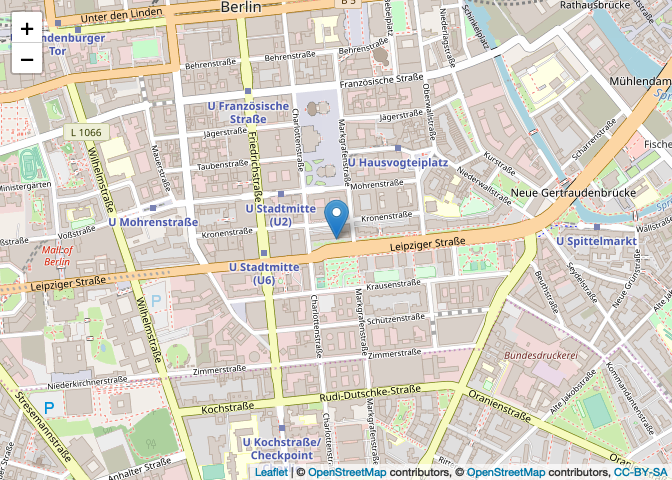

<!-- README.md is generated from README.Rmd. Please edit that file -->
[](https://travis-ci.org/JohannesFriedrich/senseBox) [](https://ci.appveyor.com/project/JohannesFriedrich/sensebox/branch/master) [](https://codecov.io/gh/JohannesFriedrich/senseBox) [](http://www.repostatus.org/#active)

### Installation

``` r
if(!require("devtools"))
  install.packages("devtools")
devtools::install_github("JohannesFriedrich/senseBox@master")
```

### Usage

Get some information about the senseBox project and list all senseBoxIds

``` r
library(senseBox)
## Loading required package: httr

stats <- get_senseBox_stats()
```

<table>
<thead>
<tr>
<th style="text-align:left;">
variable
</th>
<th style="text-align:right;">
value
</th>
</tr>
</thead>
<tbody>
<tr>
<td style="text-align:left;">
Number of senseBoxes
</td>
<td style="text-align:right;">
949
</td>
</tr>
<tr>
<td style="text-align:left;">
Number of Measurements
</td>
<td style="text-align:right;">
447929079
</td>
</tr>
<tr>
<td style="text-align:left;">
Number of measurements in last minute
</td>
<td style="text-align:right;">
1418
</td>
</tr>
</tbody>
</table>
``` r
Id_list <- get_senseBox_Ids(txtProgressBar = FALSE)
```

<table>
<thead>
<tr>
<th style="text-align:left;">
senseBoxId
</th>
<th style="text-align:left;">
name
</th>
</tr>
</thead>
<tbody>
<tr>
<td style="text-align:left;">
5386026e5f08822009b8b60d
</td>
<td style="text-align:left;">
CALIMERO
</td>
</tr>
<tr>
<td style="text-align:left;">
538ee6a4a83415541576b777
</td>
<td style="text-align:left;">
SenGIS Arbeitsgruppe - Uni Hohenheim
</td>
</tr>
<tr>
<td style="text-align:left;">
5391be52a8341554157792e6
</td>
<td style="text-align:left;">
LeKa Berlin
</td>
</tr>
<tr>
<td style="text-align:left;">
539c00c2a83415541578eaf5
</td>
<td style="text-align:left;">
IV Gummersbach
</td>
</tr>
<tr>
<td style="text-align:left;">
539fec94a8341554157931d7
</td>
<td style="text-align:left;">
The PaderWarrior Reloded
</td>
</tr>
<tr>
<td style="text-align:left;">
53a0017aa834155415793281
</td>
<td style="text-align:left;">
Alt-Lietzow
</td>
</tr>
</tbody>
</table>
We chose one ID for the following examples

``` r
senseBoxId <- c("592ca4b851d3460011ea2635")
```

Show location of senseBox

``` r
location <- get_senseBox_location(senseBoxId)

library(leaflet)
library(htmltools)

leaflet(location) %>%
  addTiles() %>%  
  addMarkers(~long, ~lat, popup = ~htmltools::htmlEscape(name))
```



Get some information about the senseBox sensors

``` r
sensor_info <- get_senseBox_sensor_info(senseBoxId)
```

<table>
<thead>
<tr>
<th style="text-align:left;">
title
</th>
<th style="text-align:left;">
unit
</th>
<th style="text-align:left;">
sensorType
</th>
<th style="text-align:left;">
icon
</th>
<th style="text-align:left;">
\_id
</th>
</tr>
</thead>
<tbody>
<tr>
<td style="text-align:left;">
PM10
</td>
<td style="text-align:left;">
µg/m³
</td>
<td style="text-align:left;">
SDS 011
</td>
<td style="text-align:left;">
osem-cloud
</td>
<td style="text-align:left;">
592ca4b851d3460011ea2636
</td>
</tr>
<tr>
<td style="text-align:left;">
PM2.5
</td>
<td style="text-align:left;">
µg/m³
</td>
<td style="text-align:left;">
SDS 011
</td>
<td style="text-align:left;">
osem-cloud
</td>
<td style="text-align:left;">
592ca4b851d3460011ea2637
</td>
</tr>
<tr>
<td style="text-align:left;">
Temperatur
</td>
<td style="text-align:left;">
°C
</td>
<td style="text-align:left;">
DHT22
</td>
<td style="text-align:left;">
osem-thermometer
</td>
<td style="text-align:left;">
592ca4b851d3460011ea2638
</td>
</tr>
<tr>
<td style="text-align:left;">
rel. Luftfeuchte
</td>
<td style="text-align:left;">
%
</td>
<td style="text-align:left;">
DHT22
</td>
<td style="text-align:left;">
osem-humidity
</td>
<td style="text-align:left;">
592ca4b851d3460011ea2639
</td>
</tr>
</tbody>
</table>
Download all data from the senseBox back to the last 48 h ...

``` r
data_all <- get_senseBox_data(senseBoxId)
```

... and show the data from all available senors

``` r
library(ggplot2)
library(reshape2)
library(scales)

data_melt <- melt(data_all[[1]], id.vars = c("createdAt", "value"))

ggplot(data_melt, aes(x=createdAt, y = value, colour = L1)) +
  geom_line() +
  scale_x_datetime(labels = date_format("%H:%M:%S", tz = Sys.timezone())) +
  facet_wrap(~L1, scales = "free") +
  theme(legend.position = "bottom",
        legend.title = element_blank())
```


